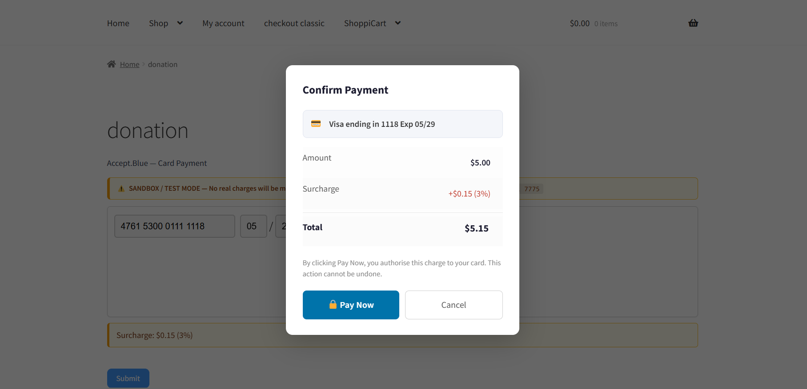
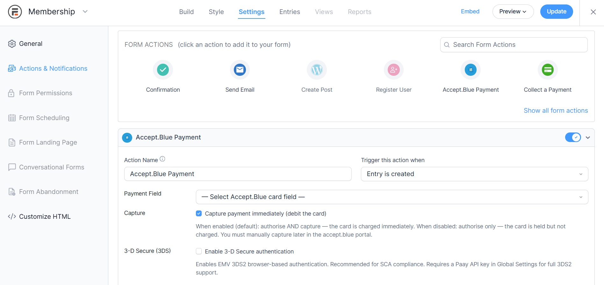
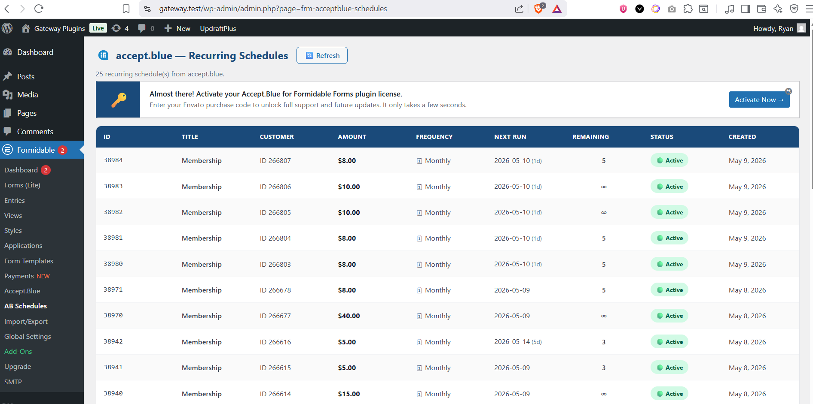
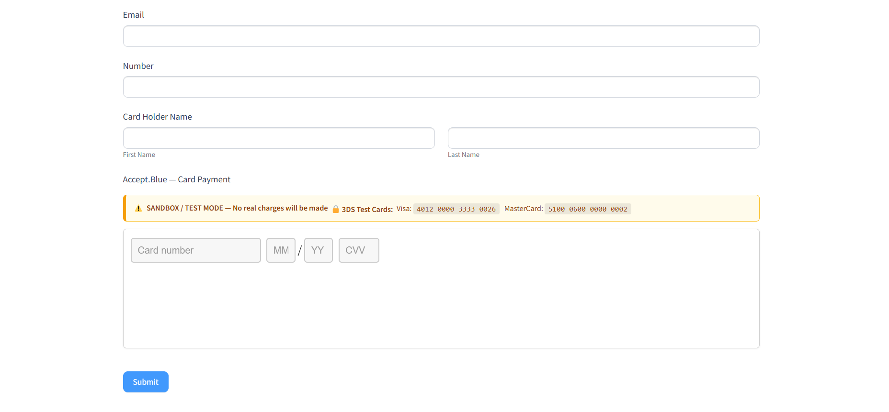
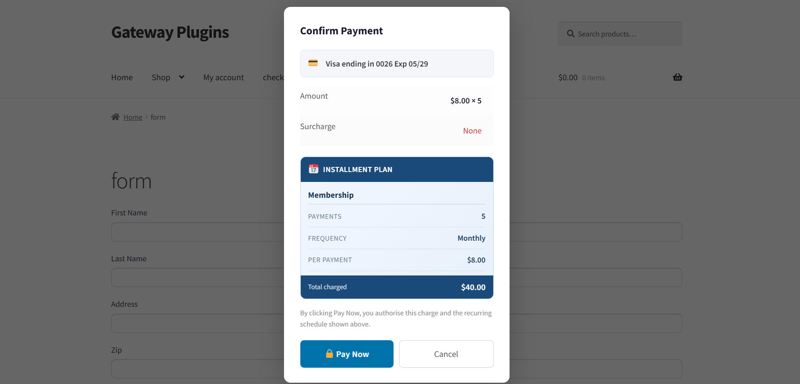

# Secure Form Checkout

> Accept credit card payments in WordPress using Formidable Forms and the accept.blue payment gateway — with PCI-friendly hosted tokenization, sandbox mode, and a seamless checkout experience.

---

This plugin integrates the **accept.blue payment gateway** directly into **Formidable Forms**, letting you securely accept online payments inside any WordPress form. It is ideal for donation forms, checkout forms, invoice payments, membership sign-ups, and subscription billing — all powered by accept.blue's PCI-compliant hosted tokenization infrastructure.

**This is the free Lite version.** Recurring billing, refunds, webhooks, fraud protection, and the admin transactions panel are available in [Pro](https://ryanplugins.net/product/formidable-accept-blue-payment-gateway/).

---

## Screenshots

### Checkout Form

### Plugin Settings — API Credentials & Sandbox Mode

### Debug Logging

### Sandbox / Test Mode

### Pro Upgrade — Subscription Settings *(Pro)*

---

## This plugin supports

- ✅ **Credit Card Payments** — Visa, Mastercard, Discover, American Express
- ✅ **Hosted Tokenization** — card data never touches your server (PCI-friendly)
- ✅ **Sandbox & Production Mode** — test safely before going live
- ✅ **Secure Hosted Payments** — embedded accept.blue iFrame on your Formidable form
- ✅ **PCI-friendly checkout** — tokenized, no raw card data stored or transmitted via your server
- ✅ **Debug Logging** — dedicated per-month log viewer in wp-admin
- 🔒 **ACH / eCheck Payments** *(Pro)*
- 🔒 **3D Secure 2 Authentication** *(Pro)*
- 🔒 **Subscriptions & Recurring Billing** *(Pro)*
- 🔒 **Installment Plans** *(Pro)*
- 🔒 **Refunds & Voids** *(Pro)*
- 🔒 **Auth-Only / Capture** *(Pro)*
- 🔒 **Admin Transactions Panel** *(Pro)*
- 🔒 **Webhook Receiver** *(Pro)*
- 🔒 **Fraud Shield** *(Pro)*

## Compatible with

- WordPress 6.0 and later
- PHP 7.4+ (PHP 8.1+ recommended)
- Formidable Forms (Free or Pro)
- Latest WordPress versions
- All major browsers

---

## Feature Comparison — Lite vs Pro

| Feature | Lite (Free) | Pro |
|---|:---:|:---:|
| Credit Card Payments | ✅ | ✅ |
| Hosted Tokenization (PCI-friendly) | ✅ | ✅ |
| Sandbox / Test Mode | ✅ | ✅ |
| Debug Logging & Log Viewer | ✅ | ✅ |
| Processing Overlay / Spinner | ✅ | ✅ |
| ACH / eCheck Payments | — | ✅ |
| 3D Secure 2 (3DS2) | — | ✅ |
| Auth-Only / Capture | — | ✅ |
| Adjust & Capture | — | ✅ |
| Refunds | — | ✅ |
| Voids | — | ✅ |
| Recurring Subscriptions | — | ✅ |
| Installment Plans | — | ✅ |
| Guest Subscription Cancellation | — | ✅ |
| Admin Transactions Panel | — | ✅ |
| 30-day Revenue Dashboard | — | ✅ |
| CSV Export | — | ✅ |
| Webhook Receiver (real-time sync) | — | ✅ |
| Fraud Shield (IP / email / country) | — | ✅ |
| Per-Form API Credential Override | — | ✅ |

[**Upgrade to Pro →**](https://ryanplugins.net/product/formidable-accept-blue-payment-gateway/)

---

## Installation

> **How to integrate accept.blue with Formidable Forms in WordPress**

1. Download the plugin zip from the [Releases](https://github.com/ryanplugins/formidable-acceptblue-lite/releases) page.
2. In your WordPress admin go to **Plugins → Add New → Upload Plugin**.
3. Upload the zip file and click **Install Now**, then **Activate Plugin**.
4. Open **Formidable → Global Settings → accept.blue**.
5. Enter your credentials from the [accept.blue merchant portal](https://accept.blue):
   - **API Key** — found under *API Keys* in your portal
   - **PIN** — only if your key uses one (leave blank otherwise)
   - **Hosted Tokenization Key** — found under *Settings → Hosted Tokenization*
6. Enable **Sandbox / Test Mode** to test without real charges.
7. Click **Test Connection** to verify your credentials.
8. Open or create a **Formidable Form**.
9. Drag the **accept.blue Card** field onto the form canvas.
10. Open **Form Actions** and add the **accept.blue Payment** action.
11. Set your amount field and currency.
12. Click **Update** and publish your form.
13. **Start accepting payments.**

> Searches this helps rank for: *how to integrate accept.blue*, *formidable forms payment setup*, *wordpress payment gateway tutorial*, *wordpress credit card plugin setup*

---

## accept.blue Formidable Forms Integration

This WordPress plugin allows businesses and developers to securely accept online payments inside **Formidable Forms** using the **accept.blue payment gateway**. It is the ideal solution for:

- **Donation forms** — one-time and recurring donations
- **Checkout forms** — sell products and services
- **Invoice payment forms** — let customers pay invoices online
- **Membership sign-up forms** — charge for access with recurring billing *(Pro)*
- **Subscription billing** — weekly, monthly, annual billing *(Pro)*
- **Registration forms with payment** — events, courses, appointments
- **WordPress merchant gateway** integration for any business type

Supports **Visa, Mastercard, Discover, and American Express** credit and debit cards. ACH/eCheck payment support available in Pro.

Built on accept.blue's **hosted tokenization** technology — card data is captured inside a secure accept.blue iFrame and never passes through your web server, making PCI compliance significantly simpler. This plugin is designed for **secure WordPress payment forms** that meet modern payment security standards.

---

## Requirements

| Requirement | Minimum | Recommended |
|---|---|---|
| WordPress | 6.0 | Latest |
| PHP | 7.4 | 8.1+ |
| Formidable Forms | Free | Pro |
| accept.blue Account | Required | — |

---

## External Links

- 🌐 [accept.blue Official Website](https://accept.blue)
- 📄 [accept.blue API Documentation](https://docs.accept.blue)
- 📄 [accept.blue Hosted Tokenization Docs](https://docs.accept.blue/tokenization/hosted)
- 🔌 [Formidable Forms](https://formidableforms.com)
- 👤 [RyanPlugins (Pro version)](https://ryanplugins.net/)

---

## Third-party Services

This plugin transmits payment data to **accept.blue**, a third-party payment processor.

| Service | Purpose | Links |
|---|---|---|
| accept.blue API | Card tokenisation & charging | [Site](https://accept.blue) · [Terms](https://accept.blue/terms) · [Privacy](https://accept.blue/privacy) |
| accept.blue Hosted Tokenization | PCI-friendly iFrame on your form | [Docs](https://docs.accept.blue/tokenization/hosted) |
| Paay 3DS *(Pro only)* | EMV 3DS2 authentication | [Site](https://www.paay.co) · [Privacy](https://www.paay.co/privacy-policy) |

No card data is stored on your server. All sensitive payment data is handled exclusively by accept.blue's PCI-compliant infrastructure.

---

## FAQ

**Does this support ACH payments?**  
ACH / eCheck transactions are available in the [Pro version](https://ryanplugins.net/product/formidable-accept-blue-payment-gateway/).

**Does this support recurring billing?**  
Yes — subscriptions and recurring payments (daily, weekly, monthly, annual and more) are supported in Pro.

**Is sandbox mode included?**  
Yes. Enable *Test / Sandbox Mode* in the plugin settings and use your accept.blue sandbox credentials. No real charges are made.

**Does this support 3D Secure 2?**  
3DS2 / EMV authentication is available in the Pro version via the Paay integration.

**Is this PCI compliant?**  
The plugin uses accept.blue's Hosted Tokenization iFrame — card numbers, CVVs, and expiry dates never pass through your web server or WordPress database, significantly reducing your PCI compliance scope.

**Can I run multiple merchant accounts?**  
Per-form API credential overrides are available in the Pro version, allowing different forms to use different accept.blue accounts.

**Can I issue refunds from WordPress?**  
Full and partial refunds and voids are available from the admin panel in the Pro version.

**Does it work with the latest version of WordPress?**  
Yes — tested up to the latest WordPress release.

**What payment methods are supported?**  
Lite: Visa, Mastercard, Discover, American Express (credit & debit cards).  
Pro adds: ACH / eCheck bank transfers.

**Does this store card numbers?**  
No. Card data is tokenised by accept.blue's iFrame before it reaches your server. No card numbers are stored anywhere in WordPress.

---

## Changelog

### v1.0.0 — Initial Release *(Lite)*
- Credit card payments via accept.blue Hosted Tokenization iFrame
- PCI-friendly checkout — card data never touches your server
- Sandbox and production mode toggle
- Test Connection button to validate API credentials
- Debug logging with in-admin log viewer and clear function
- Processing overlay / spinner on form submit
- Pro upgrade notices for locked features (recurring, refunds, webhooks, fraud shield, admin panel)

### v1.1.0 — ACH Payments *(Pro roadmap)*
- ACH / eCheck payment support via accept.blue bank transfer API

### v1.2.0 — 3D Secure 2 *(Pro roadmap)*
- EMV 3DS2 browser-based authentication via Paay integration
- Frictionless flow support for low-risk transactions

### v1.3.0 — Subscription Support *(Pro roadmap)*
- Recurring billing — daily, weekly, monthly, quarterly, annual
- Installment plan support
- Guest subscription cancellation via signed token

### v2.0.0 — Advanced Features *(Pro roadmap)*
- Fraud Shield — IP velocity, email velocity, country block-list
- Per-form API credential override for multi-merchant setups
- Admin Transactions Panel with CSV export
- Webhook receiver with HMAC-SHA256 authentication

---

## Keywords

`formidable forms payment gateway` · `accept.blue integration` · `wordpress ach payments` · `wordpress credit card plugin` · `formidable recurring payments` · `secure wordpress payment forms` · `wordpress merchant gateway` · `formidable checkout form` · `wordpress payment processing` · `wordpress subscription payments` · `hosted tokenization wordpress` · `pci compliant wordpress` · `accept.blue wordpress` · `formidable forms stripe alternative` · `wordpress recurring billing` · `secure payment forms wordpress` · `merchant services wordpress` · `checkout integration formidable` · `wordpress payment gateway tutorial` · `formidable forms checkout`

---

## License

[GPL-2.0-or-later](https://www.gnu.org/licenses/gpl-2.0.html) © [RyanPlugins](https://ryanplugins.net/)
